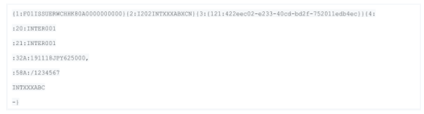

# Reference Application: Structured Products

## Overview

Structured Equity Derivative Products are used to provide custom payoffs, often for Private Bank or wealth clients, who are looking to get exposure to particular underlying company performance in a way that traditional securities do not provide. For example, I may wish to receive a higher payoff if I bet the price of an underlying security trades within a particular range. Investment banks provide these products — called Structured Products — and sell them to Intermediaries, who in turn often slice up the product and offer it to their end clients.

The term of such trades can be multiple years, with defined points in time where certain parameters are measured, compared against a predefined benchmark, and a calculation made as to whether a payment should be made.

This application shows creation and subsequent event management and payment determination for two types of trades:

*   Issuer vs. Intermediary
*   Intermediary vs. Client

## Getting Started

### Installing

**Disclaimer:** This reference application is intended to demonstrate the capabilities of the DAML. You are recommended to consider other non-functional aspects, like security, resiliency, recoverability, etc prior to production use.

#### Prerequisites

Be sure you have the following installed:
- [DAML SDK](https://docs.daml.com/)
- Docker
- Java
- Maven

#### Installing Additional Tools: Telegram Installation

Telegram is used as an optional receive confirmation messages from the app. Skip these steps if you do not want to receive notification via the Telegram application.

1. Install Telegram app on your phone.
2. Set up your Telegram account by verifying with your phone number.
3. Find your Telegram chat ID:
    1. Go to Chats menu in the application and find the existing bot called `@get_id_bot` by typing in its name to the search bar.
    2. Send the `/start` to the channel to get your Chat ID.

       Your Chat ID will be displayed. You can use it as CHAT ID. Its typical format is `<numbers>`

4. Create a new bot for the application:
    1. Find the `@BotFather` bot as described above.
    2. Choose **start**.
    3. Create your own bot by sending the `/newbot` message to the `BotFather`. Give it a unique name ending in bot. The new bot will appear in your Telegram contact list using this name.

5.  Note the token that is displayed. This will be your bot token. The usual format is:
    ```
    <numbers>:<characters>
    ```

6. Contact the new bot by sending any message to it. Otherwise it will not be allowed to relay the notifications to you.

    **Note:** You can look up your Telegram Chat ID and Telegram Bot ID by opening the respective chats in the Telegram application: `@get_id_bot`, and `@BotFather`

7. Add your Telegram Chat ID and bot token id to the telegram.properties file in your Terminal by editing the file with a text editor.

8. Specify the details of your Telegram setup.

   ```
   cp -n telegram.properties.sample telegram.properties
   ```
   Edit this file in a plain text editor and add the values for
   `BOT_TOKEN` and `CHAT_ID` you acquired in step 1 above.

   From this point, you will receive messages in Telegram.

#### Build with Maven

Type:
```shell
cp -n telegram.properties.sample telegram.properties
mvn clean package
```

**Note:** If you change the DAML models locally, you need to re-run this command before starting the application.

### Starting the App

**Note:** Make sure you have built the application with Maven (see: [Build with Maven](#build-with-maven)).

There are two options:

#### Option 1: Start App with Docker

1. Type:
    ```shell
    docker-compose up --build
    ```
2. Open UI with a browser at http://localhost:7500.

##### Observing Output Files
1. In another terminal, list the running docker containers.
   ```
   `docker ps
   ````
2. Select the container id of the one whose image name contains `digitalasset/structured-products-bots`
3. Run a shell in that container which will open a new prompt at `/home/sdk/ #`
   ````
   `docker exec -i -t <container_id> /bin/sh
   ````
4. List the files.
   ````
   `cd ./output_messages
   `ls -l
   ````
5. Print file content.
   ````
   `cat <file_ name>
   ````
6. To exit from this shell press **Ctrl+D**.

#### Option 2: Start App in Standalone

1. Start the DAML Sandbox and Navigator. Type:
    ```shell
    daml start
    ```
    The navigator will automatically open in new browser tab at http://localhost:7500.
2. Start the automation logic by starting bots. Type:
    ```shell
    java -jar target/structured-products-1.0.0-SNAPSHOT.jar
    ```

##### Observing Output Files
1. In another terminal, first go to the folder that you started the bots from. Then list the files.
   ```
   cd ./output_messages
   ls -l
   ```
2. Print file content.
   ```
   cat <file_ name>
   ```
### Stopping the App

#### Stopping Dockerized Run
1. Stop the Docker containers or bots by pressing **Ctrl+C**. (Alternatively, you can also stop it by typing `docker-compose down`.)

#### Stopping Standalone Run
1. Stop the bots by pressing **Ctrl+C**.
1. Stop the Sandbox and the Navigator by pressing **Ctrl+C** in the DAML assistant.

### Resetting the Prototype

Reset the application by following these steps:
1.  Stop the app by following the steps in [Stopping the App](#stopping-the-app) section.
2.  Start the app in [Docker](#using-docker) or [Standalone](#standalone-mode) by following the steps in the relevant section.

## Walkthrough

### Logging In

As you work through the steps described in this section, log in as different users in Navigator (Issuer, Intermediary, Client, Regulator).

To log in:

*   On the home screen, select the party from the list.

To switch users:

1. Click the name of the current party at the top of the screen.
2. On the home screen, select a different party.

**Note:** The Navigator for this demo has been designed with tabs that show the different types of reporting that can be done when for such a workflow in DAML. The point here is that it is very simple to pull separate information off the ledger (Sandbox).

*   Market data: shows the preset market data observations for the two underlyings
*   Trade details: shows trade proposals and accepted trades
*   Events: shows generated events as a result of lifecycling the DCN
*   Payments: shows the payments generated off the back of events (shows payer, payee, amount, currency, account details)

### Demo Data

All demo data is created when the application is run, using DAML scenarios. This data includes:

*   Participant roles
*   Product Term Sheet
*   Schedule of dates that are used during the demo
*   Market data

Data is summarized here with additional information on each at the end of this document in [Additional Information](#additional-information).

#### Roles

<table>
  <tr>
   <td><strong>Role</strong>
   </td>
   <td><strong>Description</strong>
   </td>
  </tr>
  <tr>
   <td>Issuer
   </td>
   <td>Issuer of a Digital Contract Note (DCN)
   </td>
  </tr>
  <tr>
   <td>Intermediary
   </td>
   <td>Distributor of the structured products who has a contract with the Issuer
   </td>
  </tr>
  <tr>
   <td>Client
   </td>
   <td>End client who has a contract with the Intermediary
   </td>
  </tr>
  <tr>
   <td>Regulator
   </td>
   <td>Regulator who is entitled to see all trades, events and payments
   </td>
  </tr>
</table>

#### Term Sheet

The details of the product are pre-loaded in the demo. An auto-callable Digital Contract Note (DCN)  combines a fixed income instrument (variable coupon payment) with optionality based on price of the underlyings.

#### Schedule

A schedule of dates that is agreed to upfront dictates on what dates market data observations will be recorded. This schedule will also define the pay date for any cash payments that are generated as a result of the market data observations.

**Coupon Event**

On 11 November, 2019, if the observed market price for NKY is above JPY 17359.12 AND the observed market price for INDU is above USD 20304.59, then a coupon of 5% of the notional will be paid from Issuer to Intermediary (and subsequently the Intermediary to the Client), with a payment date of 18 November, 2019.

**Knockout Event**

On 8 February, 2022, if the observed market price for NKY is above JPY 21687.65 AND the observed market price for INDU is above USD 25380.74, then the trade will knock out, and the full notional value will be returned to the Intermediary (by the Issuer) and to the Client (by the Intermediary).

#### Market Data

Structured Products normally generate events in response to market data observations (e.g., equity prices). These have been pre-loaded in the demo.

### Application Steps

**Note:** This demo is designed to show event generation and visibility to different entities connected to the platform without any user errors or exception handling. It is also a very simplified version of a structured product and models only coupon events and one knockout event. A full production implementation would include additional features, handle errors and exceptions, and incorporate appropriate security controls.

#### New Trade: Issuer vs. Intermediary

Follow these steps:

1. Log in as **Issuer**.
2. Click on **Trade Details.**

    You will see the pre-canned Trade Proposal between the Issuer and Intermediary and summary information: Product ID, Notional, Issuer, Buyer, Terms. Note that there is no Trade ID, as the trade has not yet been accepted by the Intermediary.

3. Click on the contract and view all the details of the Term Sheet that has been pre-canned.
   Note the Trade Proposal Contract number.

4. Switch users and log in as **Intermediary**.
5. Click on **Trade Details.**

    You will see the same Trade Proposal between the Issuer and Intermediary and summary information: Product ID, Notional, Issuer, Buyer, Terms. Note that the Trade Proposal Contract number is the same.

6. Click on the contract and view all the details of the Term Sheet that have been preset.
7. Switch users and log in as **Client**.
8. Click on **Trade Details.**

    You will see a blank screen as there has been no independent trade created between the Intermediary and the Client.

9. Switch users and log in as **Intermediary**.
10. Click on **Trade Details.**
11. Click into the Proposal contract.
2. Select the **Accept** choice.
    1. Enter INTER001 as tradeid.
    2. Enter INTXXXABC as bic.
    3. Enter 1234567 as iban.
    4. Click **Submit.**
12. Go to **Trade Details** and see that the Proposal contract has now been replaced by Trade contract. Note the contract #10:1.
13. Click on **Include Archived** to show the now archived Proposal contract.
14. Switch users and log in as **Issuer**.
15. Click on **Trade Details.**

    The Proposal contract has now been replaced by the Trade contract. Note the contract #10:1 (same as Intermediary).

16. Click on **Include Archived** to show the now archived Proposal contract.

#### New Trade: Intermediary vs. Client

You now need to leverage the same business process for the trade between the Intermediary and the Client.

Follow these steps:

1. Switch users and log in as **Intermediary**.
2. Click on **Trade Details.**
3. Click on the Trade contract.

    1. Select the ProposeTradeToClient choice.
    2. Enter Client as the client.
    3. Enter 26000000 as notional (26 million, less than the original 50 million notional between Issuer and Intermediary).
    4. Click **Submit.**
4. Click on **Trade Details**

    There is now a new Proposal contract (vs. Client) as well as the Trade contract (vs. the Issuer). Note the contract # of the Proposal.

5. Switch users and log in as **Client**.
6. Click on **Trade Details.**

    The contract # of the Proposal is the same as that on the Intermediary.

7. Click on the Proposal contract.

    1. Click **Accept.**
    2. Enter CLIENT001 as tradeid.
    3. Enter CLIXXXABC as bic.
    4. Enter 5678910 as iban.
    5. Click **Submit.**
8. Go to **Trade Details** and see that the Proposal contract has now been replaced by the Trade contract. Note the contract number.
9. Click on **Include Archived** to show the now archived Proposal contract.
10. Switch users and log in as Issuer.
11. Click on **Trade Details.**

    The new Trade between Intermediary and the Client is not visible.

#### New Trade: Regulator

Follow these steps:

1. Switch users and log in as **Regulator**.
2. Click on **Trade Details**.

    Note that as the Regulator, you can see both trades.

#### Coupon Event: Issuer vs. Intermediary

Follow these steps:

1. Switch users and log in as **Issuer**.
2. Click on the **Market Data** tab and note that there is observed market data for 11 November, 2019, for both underlyings (contract #7:0).
3. Change the system date to 11 November, 2019.
4. Click on the **Trade Details** tab.
5. Click on Trade contract:

    1. Click **Lifecycle.**
    2. Enter #7:0 as marketDataCid.
    3. Click **Submit.**
6. Click on the **Events** tab and note that a Coupon event has been generated that shows the relevant information: which trade it relates to, payment date, closing prices vs. strikes.
7. Click on the **Payment Instructions** tab and note that a Payment instruction has been generated, and the screen shows relevant information: trade it relates to, currency and amount, payment date, payer BIC and IBAN, and payee BIC and IBAN.
8. Switch users and log in as **Intermediary**.
9. Click on the **Events** tab and note that the same Coupon event has been generated and shows the relevant information: which trade it relates to, payment date, closing prices vs. strikes.
10. Click on the **Payment Instructions** tab.
    Note that the same Payment instruction has been generated, and the screen shows relevant information: trade it relates to, currency and amount, payment date, payer BIC and IBAN, and payee BIC and IBAN.
11. Switch users and log in as **Client**.
12. Click on **Events** and then the **Payment Instructions** tab, noting that both are blank as no events or payments have yet been generated for the Intermediary vs. Client trade.
13. In Finder, go to the /Users/<logged in user id>/desktop/swift_messages folder.

    You will see that a sample SWIFT MT202 payment message that has been generated for the payment between the Issuer and the Intermediary. All SWIFT messages are written to this folder, which is a subfolder under the folder from which the bots were started.


 

14. If you have enabled the Telegram bot (search on Telegram for @DAMLBot), you will have received the event details in one message and the payment details (same MT202) in a separate message.

#### Coupon Event: Intermediary vs. Client

Follow these steps:

1. Go to the **Intermediary** window.
2. Click on the **Market Data** tab and note that there is observed market data for 11 November, 2019, for both underlyings (contract #7:0).
3. Click on the **Trade Details** tab.
4. Click on the Trade contract with CLIENT001 as Trade ID.

    1. Click **Lifecycle.**
    2. Enter #7:0’ as marketDataCid.
    3. Click **Submit**.
5. Click on the **Events** tab and note that a Coupon event has been generated that shows the relevant information: which trade it relates to, payment date, closing prices vs. strikes.
6. Click on the **Payment Instructions** tab and note that a Payment instruction has been generated, and the screen shows relevant information: trade it relates to, currency and amount, payment date, payer BIC and IBAN, and payee BIC and IBAN.
7. Switch users and log in as **Client**.
8. Go to the **Client** window and click on the **Events** tab and note that the same Coupon event has been generated and shows the relevant information: which trade it relates to, payment date, closing prices vs. strikes.
9. Click on the **Payment Instructions** tab and note that the same Payment instruction has been generated, and the screen shows relevant information: trade it relates to, currency and amount, payment date, payer BIC and IBAN, and payee BIC and IBAN.
10. Switch users and log in as **Issuer**.
11. Click on **Events** and then **Payment Instructions** tab.

    Only one Event and one Payment Instruction are visible.

12. In Finder, go to the /Users/<logged in user id>/desktop/swift_messages folder.

    You will see a sample SWIFT MT202 payment message that has been generated for the payment between the Issuer and the Intermediary.

13. If you have enabled the Telegram bot (search on Telegram for @DAMLBot), you will have received the event details in one message and the payment details (same MT202) in a separate message.

#### Knockout Event: Issuer vs. Intermediary

Follow these steps:

1. Switch users and log in as **Issuer**.
2. Click on the **Market Data** tab and note that there is observed market data for 8 February, 2022, for both underlyings (contract #10:0),
3. Change the system date to 8 February, 2022.
4. Click on the **Trade Details** tab.
5. Click on Trade contract:
    1. Click on **Lifecycle.**
    2. Enter #10:0 as marketDataCid.
    3. Click **Submit.**
6. Click on the **Events** tab and note that now a Knockout event has been generated that shows the relevant information: which trade it relates to, payment date, closing prices vs. strikes.
7. Click on the **Payment Instructions** tab and note that now a Payment instruction has been generated for the full notional because the trade has knocked out. The screen shows relevant information: trade it relates to, currency and amount, payment date, payer BIC and IBAN, and payee BIC and IBAN.
8. Switch users and log in as **Intermediary**.
9. Click on the **Events** tab.

    The same Knockout event has been generated that shows the relevant information: which trade it relates to, payment date, closing prices vs. strikes.

10. Click on the **Payment Instructions** tab and note that the same Payment instruction has been generated, and the screen shows relevant information: trade it relates to, currency and amount, payment date, payer BIC and IBAN, and payee BIC and IBAN.
11. In Finder, go to the /Users/<logged in user id>/desktop/swift_messages folder.

    You will see a sample SWIFT MT202 payment message that has been generated for the payment between the Issuer and the Intermediary

12. If you have enabled the Telegram bot (search on Telegram for DAMLBot), you will have received the event details in one message and the payment details (same MT202) in a separate message.

#### Knockout Event: Intermediary vs. Client

Follow these steps:

1. Switch users and log in as **Intermediary**.
2. Click **Refresh** (this picks up the new system date).
3. Click on **Market Data** tab and note that there is observed market data for 8 February, 2022, for both underlyings (contract #10:0).
4. Click on the **Trade Details** tab.
5. Click on Trade contract:
    1. Click on **Lifecycle.**
    2. Enter #10:0 as marketDataCid.
    3. Click **Submit**.
6. Click on the **Events** tab and note that now a Knockout event has been generated that shows the relevant information: which trade it relates to, payment date, closing prices vs. strikes.
7. Click on the **Payment Instructions** tab and note that now a Payment instruction has been generated, and the screen shows relevant information: trade it relates to, currency and amount, payment date, payer BIC and IBAN, and payee BIC and IBAN.
8. Switch users and log in as **Client**.
9. Go to the **Client** window and click on the **Events** tab and note that the same Knockout event has been generated that shows the relevant information: which trade it relates to, payment date, closing prices vs. strikes.
10. Click on the **Payment Instructions** tab and note that the same Payment instruction has been generated, and the screen shows relevant information: trade it relates to, currency and amount, payment date, payer BIC and IBAN, and payee BIC and IBAN.
11. In Finder, go to the /Users/<logged in user id>/desktop/swift_messages folder.

    You will see a sample SWIFT MT202 payment message that has been generated for the payment between the Issuer and the Intermediary.

12. If you have enabled the Telegram bot (search on Telegram for @DAMLBot), you will have received the event details in one message and the payment details (same MT202) in a separate message.

#### Events and Payment Instructions - Regulator

Follow these steps:

1. Switch users and log in as **Regulator**.
2. Click on the **Events** and **Payment Instructions** tabs.

    On each tab, all Events and Payment Instructions are visible.

## Additional Information

### Term Sheet

The details of the product are pre-loaded in the demo and are summarised in this table and can be observed in the DAML code.

<table>
  <tr>
   <td><strong>Parameter</strong>
   </td>
   <td><strong>Detail</strong>
   </td>
   <td><strong>Notes</strong>
   </td>
  </tr>
  <tr>
   <td>Product ID
   </td>
   <td>DCN
   </td>
   <td>
   </td>
  </tr>
  <tr>
   <td>Notional
   </td>
   <td>50,000,000
   </td>
   <td>
   </td>
  </tr>
  <tr>
   <td>Currency
   </td>
   <td>JPY
   </td>
   <td>
   </td>
  </tr>
  <tr>
   <td>Issue Price Percentage
   </td>
   <td>100%
   </td>
   <td>
   </td>
  </tr>
  <tr>
   <td>Underlying Index 1
   </td>
   <td>NKY
   </td>
   <td>Nikkei 225
   </td>
  </tr>
  <tr>
   <td>Underlying Index 2
   </td>
   <td>INDU
   </td>
   <td>Dow Jones Industrial Average
   </td>
  </tr>
  <tr>
   <td>Trade Date
   </td>
   <td>2 November 2018
   </td>
   <td>
   </td>
  </tr>
  <tr>
   <td>Maturity Date
   </td>
   <td>16 November 2023
   </td>
   <td>
   </td>
  </tr>
  <tr>
   <td>Underlying Index 1 Coupon Strike
   </td>
   <td>17350.12
   </td>
   <td>
   </td>
  </tr>
  <tr>
   <td>Underlying Index 1 Coupon Strike CCY
   </td>
   <td>JPY
   </td>
   <td>
   </td>
  </tr>
  <tr>
   <td>Underlying Index 2 Coupon Strike
   </td>
   <td>20304.59
   </td>
   <td>
   </td>
  </tr>
  <tr>
   <td>Underlying Index 2 Coupon Strike CCY
   </td>
   <td>USD
   </td>
   <td>
   </td>
  </tr>
  <tr>
   <td>Underlying Index 1 Knockout Strike
   </td>
   <td>21687.65
   </td>
   <td>
   </td>
  </tr>
  <tr>
   <td>Underlying Index 1 Knockout Strike CCY
   </td>
   <td>JPY
   </td>
   <td>
   </td>
  </tr>
  <tr>
   <td>Underlying Index 2 Knockout Strike
   </td>
   <td>25380.74
   </td>
   <td>
   </td>
  </tr>
  <tr>
   <td>Underlying Index 2 Knockout Strike CCY
   </td>
   <td>USD
   </td>
   <td>
   </td>
  </tr>
  <tr>
   <td>Variable Interest Rate - min
   </td>
   <td>0.001
   </td>
   <td>This is the amount of interest that will be paid on the notional value if the observed market price on the observation date is < the defined coupon strike price for each underlying
   </td>
  </tr>
  <tr>
   <td>Variable Interest Rate - max
   </td>
   <td>0.05
   </td>
   <td>This is the amount of interest that will be paid on the notional value if the observed market price on the observation date is > the defined coupon strike price for each underlying
   </td>
  </tr>
</table>

### Schedule

<table>
  <tr>
   <td><strong>Coupon Observation</strong>
<p>
<strong>Dates</strong>
   </td>
   <td><strong>NKY Coupon Strike</strong>
<p>
<strong>(JPY)</strong>
   </td>
   <td><strong>INDU Coupon Strike</strong>
<p>
<strong>(USD)</strong>
   </td>
   <td><strong>KO Determination</strong>
<p>
<strong>Dates</strong>
   </td>
   <td><strong>NKY KO Price</strong>
<p>
<strong>(JPY)</strong>
   </td>
   <td><strong>INDU KO Price</strong>
<p>
<strong>(USD)</strong>
   </td>
   <td><strong>Interest / Redemption</strong>
<p>
<strong>Payment Dates</strong>
   </td>
  </tr>
  <tr>
   <td>(2019, Feb, 11)
   </td>
   <td>17350.12
   </td>
   <td>20304.59
   </td>
   <td>(2019, Feb, 8)
   </td>
   <td>21687.65
   </td>
   <td>25380.74
   </td>
   <td>(2019, Feb, 19)
   </td>
  </tr>
  <tr>
   <td>(2019, May, 9)
   </td>
   <td>17350.12
   </td>
   <td>20304.59
   </td>
   <td>(2019, May, 9)
   </td>
   <td>21687.65
   </td>
   <td>25380.74
   </td>
   <td>(2019, May, 16)
   </td>
  </tr>
  <tr>
   <td>(2019, Aug, 9)
   </td>
   <td>17350.12
   </td>
   <td>20304.59
   </td>
   <td>(2019, Aug, 8)
   </td>
   <td>21687.65
   </td>
   <td>25380.74
   </td>
   <td>(2019, Aug, 16)
   </td>
  </tr>
  <tr>
   <td><strong>(2019, Nov, 11)</strong>
   </td>
   <td><strong>17350.12</strong>
   </td>
   <td><strong>20304.59</strong>
   </td>
   <td><strong>(2019, Nov, 11)</strong>
   </td>
   <td><strong>21687.65</strong>
   </td>
   <td><strong>25380.74</strong>
   </td>
   <td><strong>(2019, Nov, 18)</strong>
   </td>
  </tr>
  <tr>
   <td>(2020, Feb, 10)
   </td>
   <td>17350.12
   </td>
   <td>20304.59
   </td>
   <td>(2020, Feb, 7)
   </td>
   <td>21687.65
   </td>
   <td>25380.74
   </td>
   <td>(2020, Feb, 18)
   </td>
  </tr>
  <tr>
   <td>(2020, May, 11)
   </td>
   <td>17350.12
   </td>
   <td>20304.59
   </td>
   <td>(2020, May, 11)
   </td>
   <td>21687.65
   </td>
   <td>25380.74
   </td>
   <td>(2020, May, 18)
   </td>
  </tr>
  <tr>
   <td>(2020, Aug, 10)
   </td>
   <td>17350.12
   </td>
   <td>20304.59
   </td>
   <td>(2020, Aug, 7)
   </td>
   <td>21687.65
   </td>
   <td>25380.74
   </td>
   <td>(2020, Aug, 17)
   </td>
  </tr>
  <tr>
   <td>(2020, Nov, 9)
   </td>
   <td>17350.12
   </td>
   <td>20304.59
   </td>
   <td>(2020, Nov, 9)
   </td>
   <td>21687.65
   </td>
   <td>25380.74
   </td>
   <td>(2020, Nov, 16)
   </td>
  </tr>
  <tr>
   <td>(2021, Feb, 9)
   </td>
   <td>17350.12
   </td>
   <td>20304.59
   </td>
   <td>(2021, Feb, 5)
   </td>
   <td>21687.65
   </td>
   <td>25380.74
   </td>
   <td>(2021, Feb, 16)
   </td>
  </tr>
  <tr>
   <td>(2021, May, 10)
   </td>
   <td>17350.12
   </td>
   <td>20304.59
   </td>
   <td>(2021, May, 10)
   </td>
   <td>21687.65
   </td>
   <td>25380.74
   </td>
   <td>(2021, May, 17)
   </td>
  </tr>
  <tr>
   <td>(2021, Aug, 9)
   </td>
   <td>17350.12
   </td>
   <td>20304.59
   </td>
   <td>(2021, Aug, 6)
   </td>
   <td>21687.65
   </td>
   <td>25380.74
   </td>
   <td>(2021, Aug, 16)
   </td>
  </tr>
  <tr>
   <td>(2021, Nov, 9)
   </td>
   <td>17350.12
   </td>
   <td>20304.59
   </td>
   <td>(2021, Nov, 9)
   </td>
   <td>21687.65
   </td>
   <td>25380.74
   </td>
   <td>(2021, Nov, 16)
   </td>
  </tr>
  <tr>
   <td><strong>(2022, Feb, 9)</strong>
   </td>
   <td><strong>17350.12</strong>
   </td>
   <td><strong>20304.59</strong>
   </td>
   <td><strong>(2022, Feb, 8)</strong>
   </td>
   <td><strong>21687.65</strong>
   </td>
   <td><strong>25380.74</strong>
   </td>
   <td><strong>(2022, Feb, 16)</strong>
   </td>
  </tr>
  <tr>
   <td>(2022, May, 9)
   </td>
   <td>17350.12
   </td>
   <td>20304.59
   </td>
   <td>(2022, May, 9)
   </td>
   <td>21687.65
   </td>
   <td>25380.74
   </td>
   <td>(2022, May, 16)
   </td>
  </tr>
  <tr>
   <td>(2022, Aug, 9)
   </td>
   <td>17350.12
   </td>
   <td>20304.59
   </td>
   <td>(2022, Aug, 8)
   </td>
   <td>21687.65
   </td>
   <td>25380.74
   </td>
   <td>(2022, Aug, 16)
   </td>
  </tr>
  <tr>
   <td>(2022, Nov, 9)
   </td>
   <td>17350.12
   </td>
   <td>20304.59
   </td>
   <td>(2022, Nov, 9)
   </td>
   <td>21687.65
   </td>
   <td>25380.74
   </td>
   <td>(2022, Nov, 16)
   </td>
  </tr>
  <tr>
   <td>(2023, Feb, 9)
   </td>
   <td>17350.12
   </td>
   <td>20304.59
   </td>
   <td>(2023, Feb, 9)
   </td>
   <td>21687.65
   </td>
   <td>25380.74
   </td>
   <td>(2023, Feb, 16)
   </td>
  </tr>
  <tr>
   <td>(2023, May, 9)
   </td>
   <td>17350.12
   </td>
   <td>20304.59
   </td>
   <td>(2023, May, 9)
   </td>
   <td>21687.65
   </td>
   <td>25380.74
   </td>
   <td>(2023, May, 16)
   </td>
  </tr>
  <tr>
   <td>(2023, Aug, 9)
   </td>
   <td>17350.12
   </td>
   <td>20304.59
   </td>
   <td>(2023, Aug, 8)
   </td>
   <td>21687.65
   </td>
   <td>25380.74
   </td>
   <td>(2023, Aug, 16)
   </td>
  </tr>
  <tr>
   <td>(2023, Nov, 9)
   </td>
   <td>17350.12
   </td>
   <td>20304.59
   </td>
   <td>(2023, Nov, 9)
   </td>
   <td>21687.65
   </td>
   <td>25380.74
   </td>
   <td>(2023, Nov, 16)
   </td>
  </tr>
</table>

### Market Data

<table>
  <tr>
   <td><strong>Underlying</strong>
   </td>
   <td><strong>Source</strong>
   </td>
   <td><strong>Publish Date</strong>
   </td>
   <td><strong>Created By</strong>
   </td>
   <td><strong>Price</strong>
   </td>
   <td><strong>Currency</strong>
   </td>
  </tr>
  <tr>
   <td>Index 1
   </td>
   <td>Reuters
   </td>
   <td>11 Nov 2019
   </td>
   <td>Issuer
   </td>
   <td>17500.25
   </td>
   <td>JPY
   </td>
  </tr>
  <tr>
   <td>Index 2
   </td>
   <td>Reuters
   </td>
   <td>11 Nov 2019
   </td>
   <td>Issuer
   </td>
   <td>20350.76
   </td>
   <td>USD
   </td>
  </tr>
  <tr>
   <td>Index 1
   </td>
   <td>Reuters
   </td>
   <td>11 May 2020
   </td>
   <td>Issuer
   </td>
   <td>17320.94
   </td>
   <td>JPY
   </td>
  </tr>
  <tr>
   <td>Index 2
   </td>
   <td>Reuters
   </td>
   <td>11 May 2020
   </td>
   <td>Issuer
   </td>
   <td>20304.59
   </td>
   <td>USD
   </td>
  </tr>
  <tr>
   <td>Index 1
   </td>
   <td>Reuters
   </td>
   <td>8 Aug 2021
   </td>
   <td>Issuer
   </td>
   <td>21687.65
   </td>
   <td>JPY
   </td>
  </tr>
  <tr>
   <td>Index 2
   </td>
   <td>Reuters
   </td>
   <td>8 Aug 2021
   </td>
   <td>Issuer
   </td>
   <td>25380.74
   </td>
   <td>USD
   </td>
  </tr>
  <tr>
   <td>Index 1
   </td>
   <td>Reuters
   </td>
   <td>8 Feb 2022
   </td>
   <td>Issuer
   </td>
   <td>22057.30
   </td>
   <td>JPY
   </td>
  </tr>
  <tr>
   <td>Index 2
   </td>
   <td>Reuters
   </td>
   <td>8 Feb 2022
   </td>
   <td>Issuer
   </td>
   <td>25402.47
   </td>
   <td>USD
   </td>
  </tr>
</table>

CONFIDENTIAL © 2019 Digital Asset (Switzerland) GmbH and/or its affiliates. All rights reserved.
Any unauthorized use, duplication or distribution is strictly prohibited.
